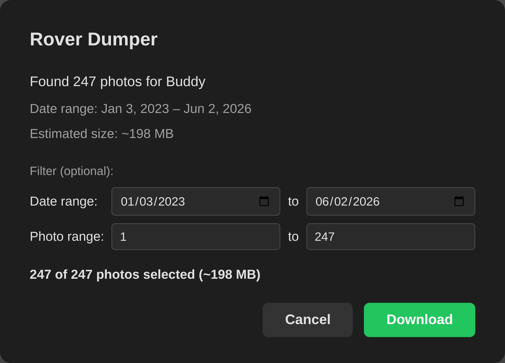

# 🐶 Rover Dumper 💩

Bulk download your pet's photos from [Rover.com](https://www.rover.com). One click, one zip file, full quality.

**[Install it here](https://rover-dumper.jklein.dev/)** – just drag a button to your bookmarks bar.



## Why

Rover.com has no bulk photo download. You can only view photos one at a time in a slideshow. This bookmarklet paginates Rover's internal API, fetches every image at full quality, zips them up, and triggers a single download.

## How It Works

1. Extracts the pet's opk (identifier) from the `/dogs/{opk}/` URL path
2. Paginates `/api/v7/pets/{opk}/images/` to collect all photo metadata
3. Shows a confirmation modal with photo count, date range, and filter controls
4. Downloads photos in parallel (concurrency: 3 workers — balances speed vs rate-limiting)
5. Strips CDN query params from image URLs to get the original full-quality file
6. Builds a zip in-memory using [JSZip](https://stuk.github.io/jszip/) with `STORE` compression (JPEGs are already compressed)
7. Triggers a browser download via Blob URL

The bookmarklet is entirely self-contained — JSZip is bundled into the minified output by esbuild. No external scripts are loaded at runtime.

## Privacy & Security

- **No server** — everything runs in your browser tab
- **No tracking** — no analytics, no cookies, no external requests beyond Rover's own API and CDN
- **No data leaves your browser** — photos go straight from Rover's CDN into a local zip file
- **Your credentials stay local** — uses your existing Rover.com login session; no passwords are accessed or stored
- **Open source** — read every line of code in [`src/rover-dumper.js`](src/rover-dumper.js)

## Browser Compatibility

| Browser | Status |
|---------|--------|
| Chrome  | Supported |
| Firefox | Supported |
| Edge    | Supported |
| Safari  | Supported (drag-to-install may vary) |
| Mobile  | Not supported (bookmarklets require a desktop browser) |

## Development

```bash
npm install                       # Install dependencies (jszip + esbuild)
npm run setup                     # Enable pre-commit auto-build
npm run build                     # Bundle + minify -> dist/rover-dumper.min.js
npm run release:check             # Verify tests and version-bearing output
npm version <major|minor|patch>   # Verify, bump, rebuild, commit, tag, and push
```

A pre-commit hook in `hooks/` automatically rebuilds and stages `dist/` and `index.html` whenever `src/` changes are committed. Run `npm run setup` after cloning to enable it.

`build.sh` bundles JSZip into the bookmarklet source via esbuild as a single IIFE, strips template literals and license comments for single-line output, then injects the result into `index.html` between marker comments. The `%` character is pre-encoded as `%25` in the HTML href to prevent browsers from misinterpreting JS modulo expressions as URL escape sequences.

## Releases

Use `npm version` as the only release entrypoint. `npm version <major|minor|patch>` runs the clean-main and remote-synchronization guard, repeats the release check, updates the version-bearing bookmarklet and landing-page files, creates the version commit and annotated `v<version>` tag, and pushes both refs atomically. The tag-triggered GitHub Actions workflow verifies the exact tagged bookmarklet and creates the published GitHub Release; an explicit workflow dispatch can safely retry an existing tag.

## License

[MIT](LICENSE)
